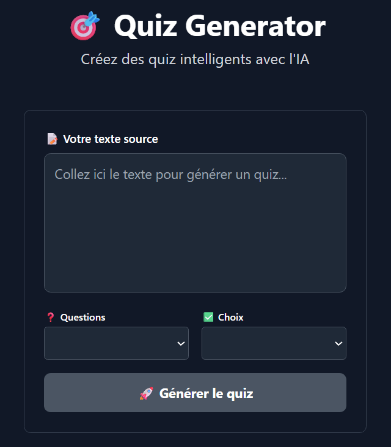
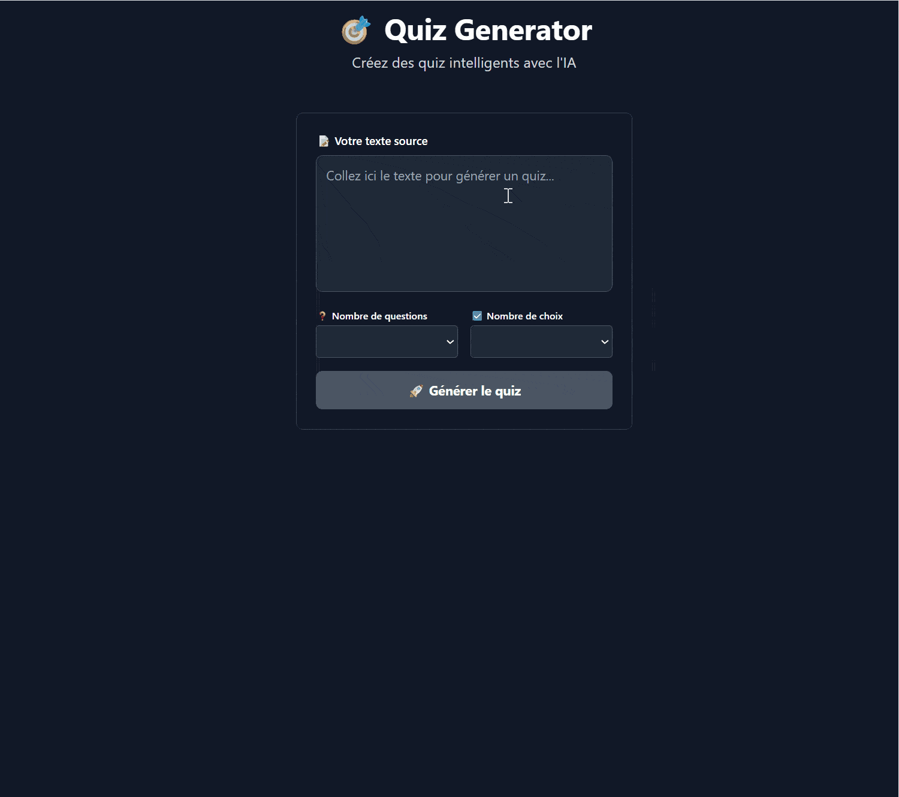
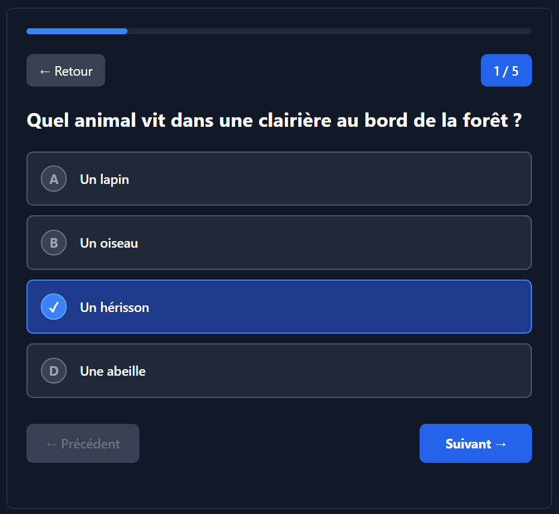
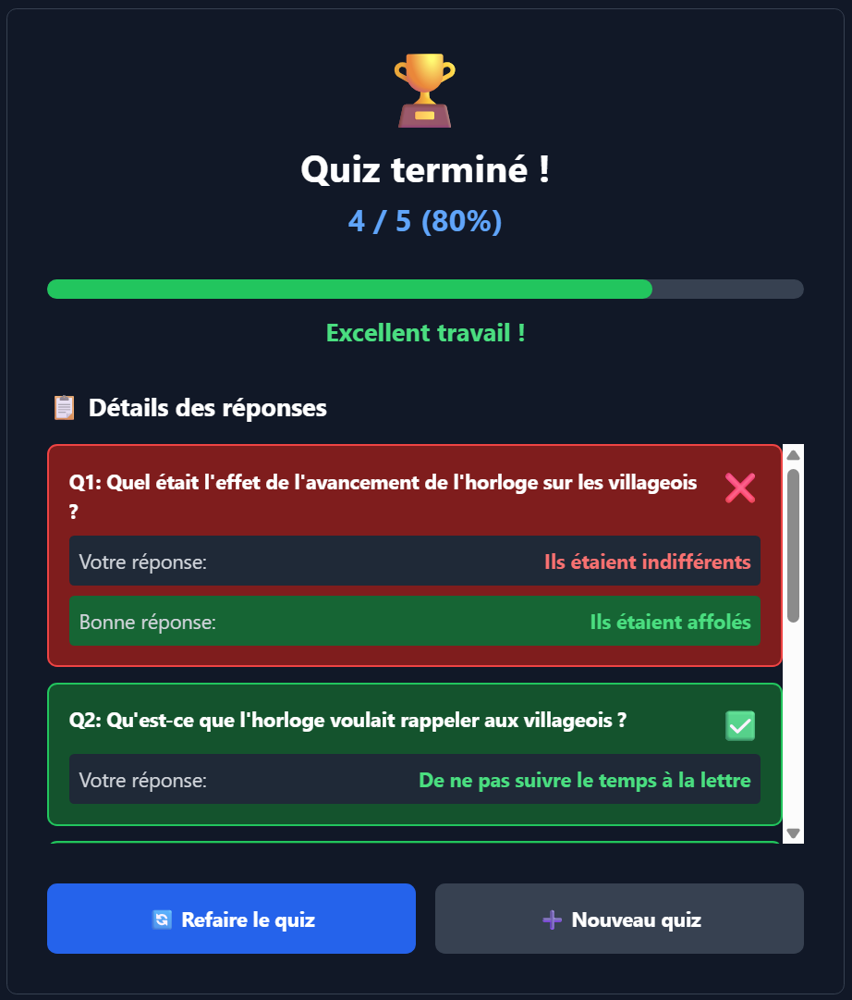

# Quiz AI

<div align="center">
  
</div>

## Introduction

Quiz AI is an intelligent quiz generator that uses AI to create interactive quizzes from any text input. Built with modern technologies including SvelteKit, Express.js, and Ollama AI models. This project is part of my studies in Prompt Engineering.

## Features

- 🎯 **Smart Quiz Generation** - Generate quizzes from any text using AI
- 🤖 **Multiple AI Models** - Supports llama3.2:latest and gemma:2b models  
- 🎮 **Interactive Quiz Player** - Modern interface for taking quizzes
- 📊 **Real-time Scoring** - Instant feedback and detailed results
- 🐳 **Docker Ready** - Multiple deployment modes (default, GPU, local)
- ⚡ **Auto Model Download** - Models download automatically on first run
- 🌙 **Dark Theme** - Modern Discord-inspired interface
- 🔧 **Configurable** - Customize number of questions and answer choices

## Demo Screenshots
<details>
    <summary>Full Demo (GIF)</summary>
    <div align="center">
        
        <br>
        <a href="./prompts/story2.txt">Used text source here</a>
    </div>
</details>

<details>
    <summary>Initial Form</summary>
    <div align="center">
        
        <br>
        <em>Input text and configure quiz settings</em>
    </div>
</details>

<details>
    <summary>Interactive Quiz Player</summary>
    <div align="center">
        
        <br>
        <em>Interactive quiz player with progress tracking</em>
    </div>
</details>

<details>
    <summary>Results Screen</summary>
    <div align="center">
        
        <br>
        <em>Detailed results with score breakdown and answer review</em>
    </div>
</details>

## How to Install

```bash
git clone https://github.com/alexyvanot/quiz-ai.git && cd quiz-ai
```

**Prerequisites:**

- Docker and Docker Compose
- For GPU mode: NVIDIA Docker Toolkit
- (Optional) Ollama installed for local mode (and pull models `llama3.2:latest` and `gemma:2b`)

## How to Run

### 🚀 Quick Start (Recommended)

```bash
docker compose up -d
```
*Models download automatically on first run (llama3.2:latest + gemma:2b)*
> Access the app at [http://localhost:5173](http://localhost:5173)

### GPU Accelerated (NVIDIA)

```bash
docker compose -f docker-compose.gpu.yml up -d
```

### Local Ollama Mode

```bash
# Start Ollama locally first
ollama serve

# Pull models if not done yet
ollama pull llama3.2:latest
ollama pull gemma:2b

# Then launch the app
docker compose -f docker-compose.local.yml up -d
```

## How to Use

1. **Access the Application**
   - Open your browser to [http://localhost:5173](http://localhost:5173)

2. **Generate a Quiz**
   - Paste your text in the input area (in order to generate the quiz related to this text)
   - Configure number of questions (3-10)
   - Select answer choices (2-4)
   - Click "Generate Quiz"

3. **Take the Quiz**
   - Answer questions interactively
   - Navigate between questions
   - View real-time progress

4. **Review Results**
   - See your score and percentage
   - Review correct/incorrect answers
   - Start a new quiz or retry

## Stop the Application

```bash
docker compose down
```

## Architecture

- **Frontend**: SvelteKit 5 with Tailwind CSS
- **Backend**: Express.js REST API
- **AI Engine**: Ollama (llama3.2:latest, gemma:2b)

## Development

### Local Development Setup

```bash
# Clone the repo
git clone https://github.com/alexyvanot/quiz-ai.git && cd quiz-ai

# Install frontend dependencies
npm install

# Install backend dependencies
cd backend && npm install

# Start development servers
cd .. && npm run dev       # Frontend (http://localhost:5173)
cd backend && npm start  # Backend (http://localhost:3001)
```

## Configuration

### Environment Variables

- `OLLAMA_URL`: Ollama server URL (default: http://ollama:11434)
- `NODE_ENV`: Environment mode (development/production)

### AI Models

- **llama3.2:latest** (2.0GB) - Main question generation model
- **gemma:2b** (1.7GB) - Alternative lightweight model

## Troubleshooting

**Common Issues:**

- If models don't download: Check Docker logs with `docker logs quiz-ai-ollama-1`
- Port conflicts: Make sure ports 5173, 3001, and 11434 are free
- GPU issues: Ensure NVIDIA Docker Toolkit is properly installed

**Tips:**

- Check the logs: `docker compose logs`
- Restart services: `docker compose restart`
- Clean restart: `docker compose down && docker compose up -d --build`

## License

This project is open source and available under the [MIT License](LICENSE).

## Acknowledgments

- Built with [Ollama](https://ollama.com/) for AI model inference
- Powered by [SvelteKit](https://kit.svelte.dev/) and [Express.js](https://expressjs.com/)
- Styled with [Tailwind CSS](https://tailwindcss.com/)

---

*Made with ❤️*
